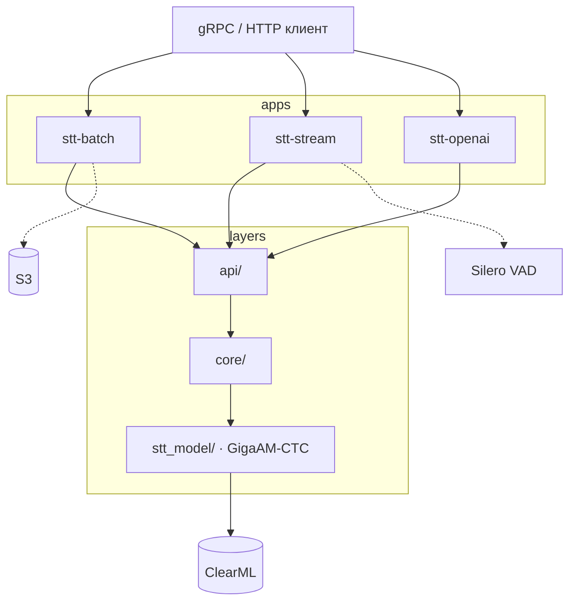

# Сервис распознавания речи


| Приложение     | Точка входа   | API                                      |
| -------------- | ------------- | ---------------------------------------- |
| **stt-batch**  | `main_batch`  | gRPC: `Recognize`, `TruthfullyRecognize` |
| **stt-stream** | `main_stream` | gRPC: `StreamingRecognize`               |
| **stt-openai** | `main_http`   | HTTP: `POST /v1/audio/transcriptions`    |


## Возможности

- **Batch gRPC** — синхронное-распознавание PCM int16; длинные записи (>30 с) обрабатываются sliding-window с overlap; загрузка аудио из S3 по URI.
- **Stream gRPC** — стрим с инкрементальным CTC-inference, partial/final результатами и детекцией конца фразы через Silero VAD.
- **HTTP API** — совместимость с OpenAI Whisper (`POST /v1/audio/transcriptions`) с декодирование произвольных аудиоформатов.
- **KenLM** — опциональный beam search decoder (`USE_KENLM=True`).
- **Finetune** — пайплайн дообучения модели с ClearML и HuggingFace Trainer.


## Требования

- Python **3.11.13** (см. `.python-version`)
- [uv](https://docs.astral.sh/uv/) для управления зависимостями
- **GPU + CUDA** для production-инференса (dev-образ работает на CPU, но медленно)
- Доступ к **ClearML** — веса модели загружаются из ClearML
- **ffmpeg** — для HTTP API и dev-окружения
- **S3** — только для `TruthfullyRecognize` в stt-batch


## Установка и запуск


### Локальная разработка

```bash
uv sync
cp .env.template .env
```

**Batch (unary, S3, длинное аудио):**

```bash
uv run python -m src.gigaam_ctc.main_batch
```

**Stream (realtime + VAD):**

```bash
uv run python -m src.gigaam_ctc.main_stream
```

**OpenAI-compatible HTTP (batch):**

```bash
uv run python -m src.gigaam_ctc.main_http
```


### Docker Compose

Запускает три сервиса (batch `:50051`, stream `:50052`, openai `:8080` на хосте):

```bash
docker compose -f docker-compose.dev.yaml up -d
# prod:
docker compose -f docker-compose.prod.yaml up -d
```

Dev-образ (`Dockerfile.dev`) монтирует `./src` и кэши HuggingFace/ClearML. Prod-образ (`Dockerfile.prod`) — CUDA 12.4, без dev-зависимостей.

### Docker (один контейнер)

```bash
docker build -f Dockerfile.prod -t stt-gigaam-ctc .

# batch (по умолчанию в CMD)
docker run --gpus all -p 50051:50051 --env-file .env stt-gigaam-ctc

# stream
docker run --gpus all -p 50052:50051 --env-file .env stt-gigaam-ctc \
  uv run --no-sync python -m src.gigaam_ctc.main_stream

# HTTP
docker run --gpus all -p 8080:8080 --env-file .env stt-gigaam-ctc \
  uv run --no-sync python -m src.gigaam_ctc.main_http
```


## Конфигурация

Полный шаблон — `.env.template`. Настройки читаются один раз при старте из `src/gigaam_ctc/config.py`.

### Сеть и режим


| Переменная         | Описание                       |
| ------------------ | ------------------------------ |
| `GRPC_SERVER_PORT` | Порт gRPC внутри контейнера    |
| `GRPC_BATCH_PORT`  | Порт batch на хосте (compose)  |
| `GRPC_STREAM_PORT` | Порт stream на хосте (compose) |
| `HTTP_SERVER_PORT` | Порт HTTP внутри контейнера    |
| `HTTP_OPENAI_PORT` | Порт HTTP на хосте (compose)   |
| `OPENAI_MODEL_ID`  | ID модели в OpenAI API         |


### Модель


| Переменная                          | Описание                               |
| ----------------------------------- | -------------------------------------- |
| `USE_FP16`                          | FP16 на CUDA                           |
| `USE_KENLM`                         | KenLM beam search decoder              |
| `FAST_WORKERS`                      | Потоки для короткого аудио и стриминга |
| `SLOW_WORKERS`                      | Потоки для длинного аудио              |
| `MODEL_VERSION` / `SERVICE_VERSION` | Версии в ответах API                   |


### Длинное аудио (stt-batch)


| Переменная                    | Описание                        |
| ----------------------------- | ------------------------------- |
| `LONG_AUDIO_THRESHOLD_S`      | Порог переключения на long path |
| `LONG_AUDIO_CHUNK_LENGTH_S`   | Длина чанка (с)                 |
| `LONG_AUDIO_STRIDE_S`         | Overlap stride (с)              |
| `LONG_AUDIO_MICRO_BATCH_SIZE` | Размер micro-batch              |


### Стриминг (stt-stream)


| Переменная                       | Описание                           |
| -------------------------------- | ---------------------------------- |
| `STREAM_PARTIAL_INTERVAL_S`      | Интервал partial-ответов (с)       |
| `STREAM_MIN_AUDIO_FOR_PARTIAL_S` | Мин. аудио для partial (с)         |
| `STREAM_INFERENCE_STEP_S`        | Шаг инкрементального inference (с) |
| `STREAM_INFERENCE_CONTEXT_S`     | Контекст между шагами (с)          |
| `STREAM_PARTIAL_BEAM_WIDTH`      | Beam width для partial             |
| `STREAM_FINAL_BEAM_WIDTH`        | Beam width для final               |
| `MAX_UTTERANCE_DURATION_S`       | Лимит длины фразы (с)              |


### VAD (stt-stream)


| Переменная                  | Описание                          |
| --------------------------- | --------------------------------- |
| `VAD_THRESHOLD`             | Порог Silero VAD                  |
| `VAD_MIN_SILENCE_MS`        | Мин. пауза для конца фразы (мс)   |
| `VAD_MIN_SPEECH_MS`         | Мин. длина речи (мс)              |
| `VAD_MIN_BUFFER_DURATION_S` | Мин. буфер перед запуском VAD (с) |


## API


### stt-batch (gRPC)

- **Recognize** — распознавание PCM int16 из поля `audio_content`
- **TruthfullyRecognize** — то же + загрузка длинных записей из S3 по URI

Ответ содержит текст, таймкоды (`WordInfo`), длительность инференса и версию сервиса.

```python
import grpc
from src.gigaam_ctc.grpc_stub import stt_pb2, stt_pb2_grpc

async with grpc.aio.insecure_channel("localhost:50051") as channel:
    stub = stt_pb2_grpc.SpeechToTextServiceStub(channel)
    response = await stub.Recognize(stt_pb2.RecognizeRequest(...))
```


### stt-stream (gRPC)

- **StreamingRecognize** — стрим: сначала `streaming_config`, затем PCM-чанки

Жизненный цикл одной фразы:

1. Клиент отправляет `streaming_config` — создаётся `StreamingSession`.
2. PCM int16 чанками → инкрементальный forward → накопление логитов.
3. Partial-ответы по интервалу `STREAM_PARTIAL_INTERVAL_S`.
4. Final — при VAD (пауза), `is_final=True` от клиента или превышении `MAX_UTTERANCE_DURATION_S`.

Потоковое распознавание использует инкрементальный пайплайн: forward по чанкам → накопление логитов → decode. Финал — `flush` последних чанков + decode по накопленным логитам.

### stt-openai (HTTP)


| Метод | Путь                       | Описание                                        |
| ----- | -------------------------- | ----------------------------------------------- |
| GET   | `/health`                  | Readiness probe (503, если модель не загружена) |
| GET   | `/v1/models`               | Список доступных моделей                        |
| POST  | `/v1/audio/transcriptions` | Распознавание загруженного аудиофайла           |


```bash
curl -X POST http://localhost:8080/v1/audio/transcriptions \
  -F file=@audio.wav \
  -F model=gigaam-ctc \
  -F response_format=json
```

Поддерживаемые `response_format`: `json` (объект с полем `text`) или `text` (plain text).

## Архитектура




### Слои


| Слой         | Назначение                                                       |
| ------------ | ---------------------------------------------------------------- |
| `api/grpc/`  | gRPC servicers, S3, сборка protobuf-ответов                      |
| `api/http/`  | FastAPI, OpenAI-compatible routes, декодирование аудио           |
| `core/`      | `RecognitionService`, `StreamingRecognitionService`, VAD, сессии |
| `stt_model/` | Model inference: batch, long-audio, инкрементальный CTC          |
| `grpc_stub/` | Сгенерированные protobuf/gRPC stubs                              |


### Структура проекта

```
src/gigaam_ctc/
├── api/
│   ├── grpc/
│   │   ├── servicer.py           # Recognize, TruthfullyRecognize
│   │   ├── stream_servicer.py    # StreamingRecognize
│   │   ├── response_builder.py
│   │   ├── registry.py
│   │   ├── server.py
│   │   └── s3_storage.py
│   └── http/
│       ├── app.py
│       ├── routes.py
│       ├── schemas.py
│       └── audio_decoder.py
├── core/
│   ├── recognition_service.py
│   ├── streaming_recognition_service.py
│   ├── streaming_session.py
│   ├── dtos.py
│   └── vad/
├── stt_model/
│   ├── model.py                  # STTModel: batch, long, streaming
│   ├── streaming_inference.py    # IncrementalCTCStreamer
│   ├── logits_processor.py
│   ├── factory.py
│   └── audio_utils.py
├── grpc_stub/
├── config.py
├── main_batch.py
├── main_stream.py
└── main_http.py

finetune/                         # дообучение модели
├── finetune.py
├── train.yaml
├── data.py
├── model.py
├── trainer.py
└── ...
```


## Дообучение

Пайплайн fine-tuning в каталоге `finetune/`:

```bash
cd finetune
uv run python finetune.py --config train.yaml
```

Конфигурация — `finetune/train.yaml`: пути к CSV с аудио, гиперпараметры, ClearML project. После обучения новые веса регистрируются в ClearML.

## Разработка


### Линтинг

```bash
uvx ruff check --fix ./src
uvx ruff format ./src
```


### Pre-commit

```bash
pre-commit install
pre-commit run --all-files
```

Хуки: `ruff check --fix` и `ruff format`.

### CI

GitLab CI (`.gitlab-ci.yml`): stages lint → build.